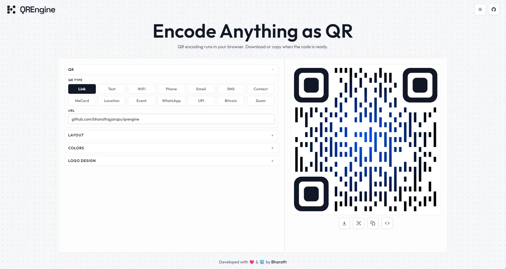

# QREngine

QREngine is a minimal, precise, and fast QR generator focused on privacy and performance. Powered by [ETiket](https://github.com/pbakaus/etiket), It runs entirely in the browser with no data collected or stored.



## Features

`Clean Interface` · `Precise Encoding` · `Fast Generation` · `Runs in Browser` · `No Data Collection` · `Multiple Formats`

## Supported QR Types

`Link` · `Text` · `WiFi` · `Phone` · `Email` · `SMS` · `Contact` · `WhatsApp` · `Location` · `Event` · `UPI` · `Bitcoin` · `Zoom`

## Tech Stack

- **Framework**: [React 19](https://react.dev/)
- **Build Tool**: [Vite 6](https://vitejs.dev/)
- **Styling**: [Tailwind CSS 4](https://tailwindcss.com/)
- **QR Logic**: [ETiket](https://github.com/pbakaus/etiket)

## Installation

1. Clone the repository:
   ```bash
   git clone https://github.com/bharathajjarapu/QREngine.git
   ```
2. Install dependencies:
   ```bash
   bun install or npm install
   ```
3. Start the development server:
   ```bash
   bun run dev or npm run dev
   ```

---
Developed with ❤️ & 💻 by [Bharath](https://github.com/bharathajjarapu)
